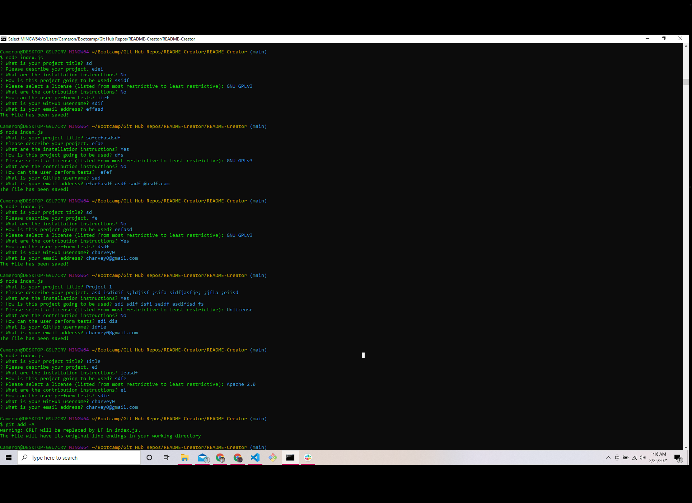

  
# **README Creator**

# Table of Contents
* [Project Description](#project-description)
* [Installation](#installation)
* [Usage](#usage)
* [Tests](#tests)
* [License](#license)
* [Contributions](#contributions)
* [Questions](#questions)
# Project Description
his app asks the user a string of questions about their project.  When the information is gathered , the app creates the project's README.md file.
    
# Installation
 1. Clone this repo  2.  Open **index.js** in the console.   3. type **npm i** in the command line.
# Usage
This app is intended to easily create an organized README for GitHub projects.
# Tests
I don't have any tests yet.  I am working on it.
# License
MIT
# Contributions
Thank you for your interest in contributing.  You can fork this project and adapt it to fit your needs.
# Questions
If you have any questions, please contact the project owner by clicking on the email listed below.  
     
#### [charvey0](https://github.com/charvey0)
#### [charvey0@gmail.com](mailto:charvey0@gmail.com)
